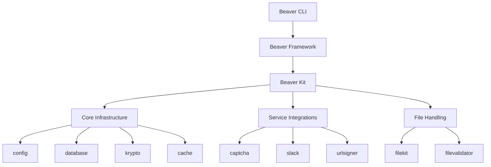

# Beaver Kit AI Documentation

## Overview

Beaver Kit is a comprehensive, modular Go framework providing production-ready components for modern applications. This AI-optimized documentation provides structured, machine-readable information about Beaver Kit's architecture, APIs, and usage patterns.

## Documentation Structure

### Core Framework Documentation
- [Framework Overview](framework-overview.md) - High-level architecture and design principles
- [Getting Started](getting-started.md) - Installation, configuration, and first steps
- [API Reference](api-reference/) - Detailed API documentation for all packages
- [Integration Patterns](integration-patterns.md) - Common usage patterns and best practices

### Package Documentation
- [Cache Package](packages/cache.md) - Flexible caching with memory and Redis drivers
- [Captcha Package](packages/captcha.md) - Multi-provider CAPTCHA validation
- [Config Package](packages/config.md) - Environment variable configuration loader
- [Database Package](packages/database.md) - SQL-first database abstraction
- [FileKit Package](packages/filekit.md) - File system abstraction with cloud storage
- [FileValidator Package](packages/filevalidator.md) - Comprehensive file validation
- [Krypto Package](packages/krypto.md) - Cryptographic utilities and JWT handling
- [Slack Package](packages/slack.md) - Slack webhook notifications
- [URLSigner Package](packages/urlsigner.md) - Secure URL signing for temporary access

### Learning Paths
- [Quick Start Guide](learning-paths/quick-start.md) - Get up and running in 5 minutes
- [Core Concepts](learning-paths/core-concepts.md) - Understanding Beaver Kit's design principles
- [Common Patterns](learning-paths/common-patterns.md) - Typical usage scenarios with complete code
- [Advanced Topics](learning-paths/advanced-topics.md) - Performance optimization and edge cases
- [Integration Guides](learning-paths/integration-guides.md) - How Beaver Kit fits into existing ecosystems

## AI Assistant Context

This documentation is specifically optimized for AI coding assistants. Each page includes:

- **Structured metadata** with JSON-LD schemas for machine readability
- **Complete code examples** with full context and error handling
- **Type definitions and schemas** for all data structures
- **Clear relationships** between components and packages
- **Progressive learning paths** from basic to advanced usage

## Framework Architecture



## Core Principles

1. **Modular Design** - Use only what you need, each package is independent
2. **Environment-First Configuration** - All packages support environment variables with `BEAVER_` prefix
3. **Secure by Default** - Built-in security features across all components
4. **Testing-Friendly** - Built-in support for testing with Reset() functions
5. **Production-Ready** - Battle-tested components with comprehensive error handling

## Key Features

- **Zero-Config Usage** - Set environment variables and start using immediately
- **Consistent Patterns** - All packages follow the same initialization and usage patterns
- **Driver-Based Architecture** - Switch implementations without code changes
- **Comprehensive Error Handling** - Detailed error types for better debugging
- **Thread-Safe** - All components are safe for concurrent use

## Quick Example

```go
package main

import (
    "context"
    "log"
    
    "github.com/gobeaver/beaver-kit/database"
    "github.com/gobeaver/beaver-kit/cache"
    "github.com/gobeaver/beaver-kit/slack"
)

func main() {
    // All packages initialize automatically from environment
    if err := database.Init(); err != nil {
        log.Fatal(err)
    }
    if err := cache.Init(); err != nil {
        log.Fatal(err)
    }
    if err := slack.Init(); err != nil {
        log.Fatal(err)
    }
    
    // Use the services
    db := database.DB()
    slack.Slack().SendInfo("Application started successfully")
    
    // Cache user session
    cache.Set(context.Background(), "session:123", []byte("user-data"), 0)
}
```

## Environment Configuration

All packages use the `BEAVER_` prefix for environment variables:

```bash
# Database
BEAVER_DB_DRIVER=postgres
BEAVER_DB_HOST=localhost
BEAVER_DB_DATABASE=myapp

# Cache
BEAVER_CACHE_DRIVER=redis
BEAVER_CACHE_HOST=localhost

# Slack
BEAVER_SLACK_WEBHOOK_URL=https://hooks.slack.com/services/...

# Captcha
BEAVER_CAPTCHA_PROVIDER=recaptcha
BEAVER_CAPTCHA_SITE_KEY=your-site-key
BEAVER_CAPTCHA_SECRET_KEY=your-secret-key
```

## Next Steps

- Start with the [Quick Start Guide](learning-paths/quick-start.md)
- Understand [Core Concepts](learning-paths/core-concepts.md)
- Explore [Package Documentation](packages/) for specific features
- Review [Integration Patterns](integration-patterns.md) for real-world usage