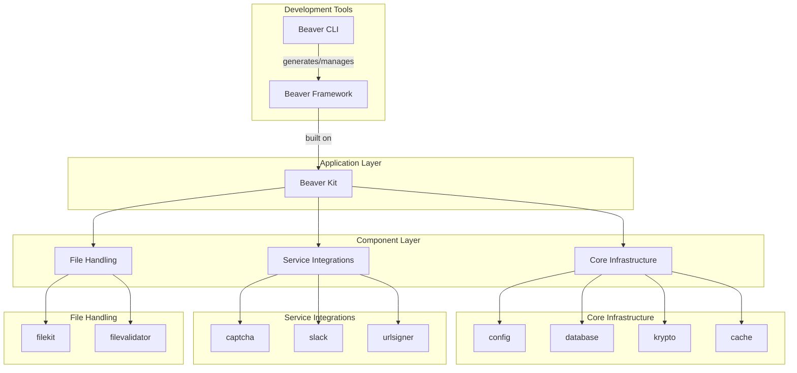
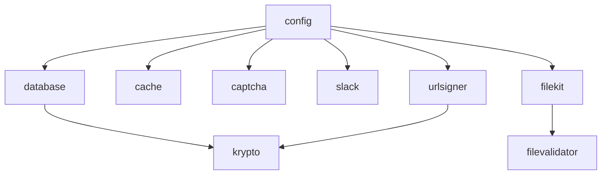

# Beaver Kit Framework Overview

## Purpose and Design Philosophy

Beaver Kit is a comprehensive, modular Go framework designed to provide production-ready components for modern applications. The framework follows a **driver-agnostic, environment-first** approach that enables seamless switching between implementations without code changes.

### Core Design Principles

1. **Modular Architecture** - Each package is independently usable
2. **Environment-First Configuration** - All settings configurable via environment variables
3. **Driver-Based Abstraction** - Switch implementations (memory/Redis, local/S3) without code changes
4. **Secure by Default** - Built-in security features and best practices
5. **Testing-Friendly** - Reset functions and test utilities built-in
6. **Production-Ready** - Comprehensive error handling and monitoring

## Framework Layers



### Layer Responsibilities

#### Beaver Kit (Component Layer)
- **Purpose**: Modular, driver-agnostic, flexible components
- **Characteristics**: Independent packages, environment configuration, driver abstraction
- **Usage**: Import individual packages as needed

#### Beaver Framework (Application Layer)
- **Purpose**: Opinionated structure, conventions, patterns
- **Characteristics**: Structured project layout, integrated components, best practices
- **Usage**: Complete application framework built on Beaver Kit

#### Beaver CLI (Development Tools)
- **Purpose**: Code generation, scaffolding, migrations
- **Characteristics**: Project templates, migration tools, code generators
- **Usage**: Development and deployment automation

## Package Categories

### Core Infrastructure Packages

These packages provide fundamental functionality that other packages depend on:

#### config
- **Purpose**: Environment variable configuration loader
- **Key Features**: Struct tag support, type conversion, default values
- **Dependencies**: None (foundation package)

#### database
- **Purpose**: SQL-first database abstraction with optional GORM support
- **Key Features**: Multiple drivers (PostgreSQL, MySQL, SQLite, Turso), connection pooling, health checks
- **Dependencies**: config

#### krypto
- **Purpose**: Comprehensive cryptographic utilities
- **Key Features**: JWT tokens, password hashing, encryption, secure token generation
- **Dependencies**: config

#### cache
- **Purpose**: Flexible caching solution
- **Key Features**: Memory and Redis drivers, TTL support, namespace isolation
- **Dependencies**: config

### Service Integration Packages

These packages integrate with external services:

#### captcha
- **Purpose**: Multi-provider CAPTCHA validation
- **Key Features**: Google reCAPTCHA, hCaptcha, Cloudflare Turnstile support
- **Dependencies**: config

#### slack
- **Purpose**: Slack webhook notifications
- **Key Features**: Formatted messages, multiple instances, configurable defaults
- **Dependencies**: config

#### urlsigner
- **Purpose**: Secure URL signing for temporary access
- **Key Features**: HMAC signing, expiration, payload embedding
- **Dependencies**: config, krypto

### File Handling Packages

These packages handle file operations and validation:

#### filekit
- **Purpose**: File system abstraction supporting local and cloud storage
- **Key Features**: Local filesystem, S3 support, streaming, encryption
- **Dependencies**: config, filevalidator (optional)

#### filevalidator
- **Purpose**: Comprehensive file validation with security features
- **Key Features**: Size/type validation, content analysis, security scanning
- **Dependencies**: None

## Common Patterns

### Initialization Pattern

All packages follow a consistent initialization pattern:

```go
// Purpose: Initialize service from environment variables
// Prerequisites: Environment variables must be set with BEAVER_ prefix
// Expected outcome: Global service instance ready for use

// Option 1: Initialize from environment
if err := package.Init(); err != nil {
    log.Fatal(err)
}

// Option 2: Initialize with explicit configuration
err := package.Init(package.Config{
    // ... configuration options
})

// Option 3: Create new instance (for multiple instances)
service, err := package.New(config)
```

### Service Access Pattern

```go
// Purpose: Access initialized service instance
// Prerequisites: Package must be initialized first
// Expected outcome: Service instance for operations

// Get global instance
service := package.Service() // or package.DB(), package.Slack(), etc.

// Use service methods
result, err := service.SomeOperation(ctx, params)
```

### Testing Pattern

```go
// Purpose: Clean state for testing
// Prerequisites: None
// Expected outcome: Reset global state between tests

func TestSomeFeature(t *testing.T) {
    defer package.Reset() // Clean up after test
    
    // Initialize with test configuration
    err := package.Init(package.Config{
        // ... test configuration
    })
    if err != nil {
        t.Fatal(err)
    }
    
    // Run tests
}
```

### Error Handling Pattern

```go
// Purpose: Handle package-specific errors
// Prerequisites: Understanding of package error types
// Expected outcome: Appropriate error handling for different scenarios

if err != nil {
    if errors.Is(err, package.ErrNotInitialized) {
        // Handle not initialized error
    } else if errors.Is(err, package.ErrInvalidConfig) {
        // Handle configuration error
    } else {
        // Handle other errors
    }
}
```

## Environment Variable Conventions

All packages use the `BEAVER_` prefix for environment variables:

```bash
# Package-specific configuration
BEAVER_{PACKAGE}_{SETTING}=value

# Examples:
BEAVER_DB_DRIVER=postgres
BEAVER_DB_HOST=localhost
BEAVER_CACHE_DRIVER=redis
BEAVER_SLACK_WEBHOOK_URL=https://...
```

### Common Environment Variables

| Variable | Description | Default |
|----------|-------------|---------|
| `BEAVER_CONFIG_DEBUG` | Enable configuration debug logging | `false` |
| `BEAVER_{PACKAGE}_ENABLED` | Enable/disable package functionality | `true` |
| `BEAVER_{PACKAGE}_TIMEOUT` | Operation timeout for network calls | `30s` |

## Driver Architecture

Many packages support multiple drivers that can be switched via environment variables:

### Cache Package Drivers
```bash
BEAVER_CACHE_DRIVER=memory  # In-memory cache
BEAVER_CACHE_DRIVER=redis   # Redis cache
```

### Database Package Drivers
```bash
BEAVER_DB_DRIVER=postgres   # PostgreSQL
BEAVER_DB_DRIVER=mysql      # MySQL
BEAVER_DB_DRIVER=sqlite     # SQLite
BEAVER_DB_DRIVER=turso      # Turso/LibSQL
```

### FileKit Package Drivers
```bash
BEAVER_FILEKIT_DRIVER=local # Local filesystem
BEAVER_FILEKIT_DRIVER=s3    # AWS S3 compatible
```

## Security Architecture

### Built-in Security Features

1. **Secure Defaults** - All packages use secure configurations by default
2. **Environment Isolation** - Configuration via environment variables prevents accidental exposure
3. **Error Sanitization** - Error messages don't leak sensitive information
4. **Input Validation** - All user inputs are validated before processing
5. **Cryptographic Standards** - Modern algorithms with appropriate parameters

### Security Patterns

```go
// Purpose: Secure password handling
// Prerequisites: User input validation
// Expected outcome: Securely hashed password

// Hash password securely
hash, err := krypto.Argon2idHashPassword(password)
if err != nil {
    return fmt.Errorf("password hashing failed: %w", err)
}

// Verify password
valid, err := krypto.Argon2idVerifyPassword(password, hash)
if err != nil {
    return fmt.Errorf("password verification failed: %w", err)
}
```

## Performance Considerations

### Connection Pooling
- Database package includes configurable connection pooling
- Cache package optimizes Redis connections
- All network operations support context-based timeouts

### Memory Management
- Memory cache driver includes size and key limits
- File operations use streaming to handle large files
- Proper resource cleanup with defer statements

### Concurrency
- All packages are thread-safe
- Global instances use appropriate synchronization
- Context support for cancellation and timeouts

## Integration Points

### Package Dependencies



### External Dependencies

- **Database Drivers**: Pure Go implementations (no CGO)
- **HTTP Libraries**: Standard library and minimal external dependencies
- **Cryptographic Libraries**: Go standard library crypto packages
- **Cloud SDKs**: Official AWS, Google Cloud SDKs for file operations

## Monitoring and Observability

### Health Checks
```go
// Purpose: Monitor service health
// Prerequisites: Service must be initialized
// Expected outcome: Health status information

// Check if service is healthy
if database.IsHealthy() {
    stats := database.Stats()
    log.Printf("DB connections: %d", stats.OpenConnections)
}

// Detailed health check with context
ctx, cancel := context.WithTimeout(context.Background(), 5*time.Second)
defer cancel()

if err := cache.Health(ctx); err != nil {
    log.Printf("Cache unhealthy: %v", err)
}
```

### Logging and Debugging
```bash
# Enable debug logging for configuration
BEAVER_CONFIG_DEBUG=true

# Enable debug logging for specific packages
BEAVER_DB_DEBUG=true
BEAVER_CACHE_DEBUG=true
```

## Extension Points

### Custom Drivers
Each driver-based package supports custom implementations:

```go
// Purpose: Implement custom cache driver
// Prerequisites: Implement cache.Driver interface
// Expected outcome: Custom cache backend integration

type CustomDriver struct {
    // Custom implementation
}

func (d *CustomDriver) Get(ctx context.Context, key string) ([]byte, error) {
    // Custom get implementation
}

// Register custom driver
cache.RegisterDriver("custom", func(config cache.Config) (cache.Driver, error) {
    return &CustomDriver{}, nil
})
```

### Custom Validators
```go
// Purpose: Add custom file validation
// Prerequisites: Implement Validator interface
// Expected outcome: Custom validation rules

type CustomValidator struct{}

func (v *CustomValidator) ValidateContent(reader io.Reader, size int64) error {
    // Custom validation logic
    return nil
}

// Register with filevalidator
validator.RegisterContentValidator("application/custom", &CustomValidator{})
```

## Migration and Upgrade Patterns

### Version Compatibility
- Semantic versioning for all packages
- Backward compatibility within major versions
- Clear migration guides for breaking changes

### Configuration Migration
```go
// Purpose: Migrate from old configuration format
// Prerequisites: Understanding of breaking changes
// Expected outcome: Updated configuration

// Old format (deprecated)
// BEAVER_DB_URL=postgres://...

// New format (recommended)
// BEAVER_DB_DRIVER=postgres
// BEAVER_DB_HOST=localhost
// BEAVER_DB_DATABASE=myapp
```

This framework overview provides the foundational understanding needed to effectively use Beaver Kit components in your applications. The modular design and consistent patterns make it easy to adopt incrementally and scale as your needs grow.